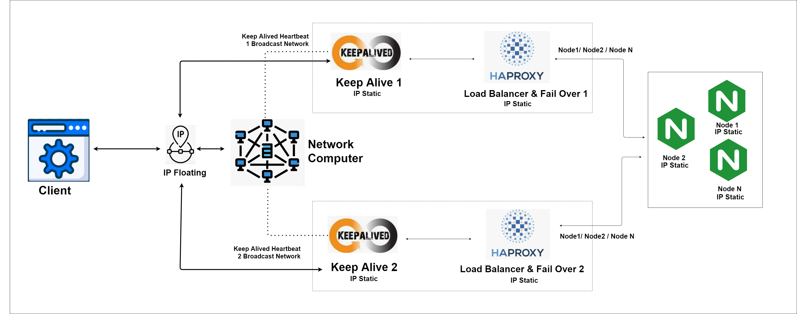
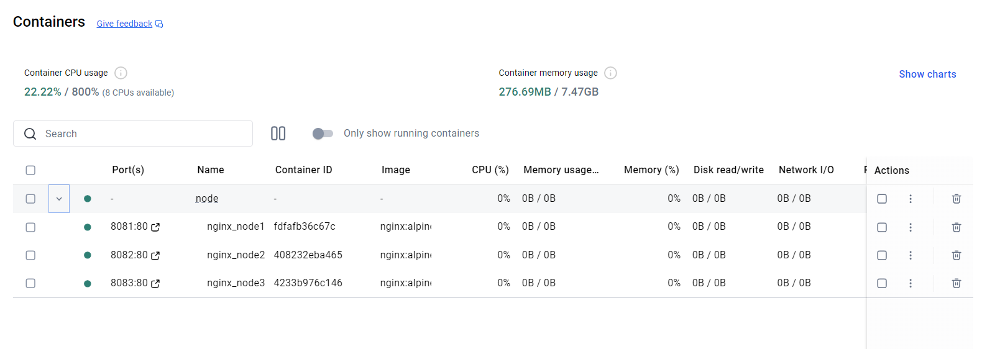
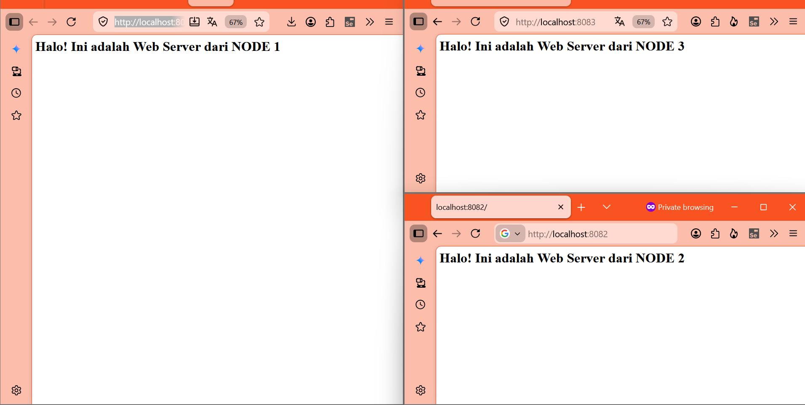
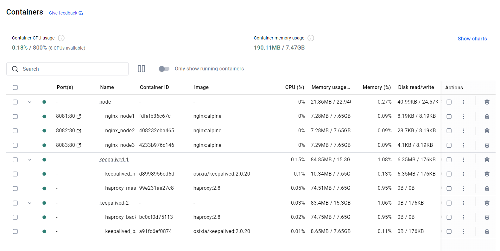

# 🚀 Keepalived HA  & Load Balancing Architecture

## 📑 Table of Contents

- [📌 Opening](#-opening)
- [📂 Project Folder Structure](#-project-folder-structure)
- [1️⃣ Concepts: Floating IP, Keepalived, HAProxy](#1️⃣-concept-introduction-floating-ip-keepalived-and-haproxy)
- [2️⃣ Architecture Explanation](#2️⃣-architecture-explanation)
- [3️⃣ Evidence Screenshots](#3️⃣-evidence-screenshots)
- [4️⃣ Benefits: Failover & Load Balancing](#4️⃣-benefits-scalability-failover--load-balancing)
- [5️⃣ Complete Infrastructure List](#5️⃣-complete-infrastructure-list)
- [🎯 Conclusion](#-conclusion)

---

## 📌 Opening

**"One server is not enough. One gateway is a single point of failure."**

Imagine you run a website. If your only server crashes, your website goes down. Your users cannot access it. Your business loses money. This is called a **Single Point of Failure (SPOF)**.

To solve this problem, we need two things:
1. **A backup system** that takes over automatically when the main system fails → **Failover**
2. **Traffic distribution** so no single server gets too many requests → **Load Balancing**

This project combines three powerful technologies to achieve both:

| Technology | Role |
|------------|------|
| **Keepalived** | Provides a **Floating (Virtual) IP** that automatically moves between servers |
| **HAProxy** | Acts as a **Load Balancer** that distributes traffic across multiple web servers |
| **Nginx** | Serves as the **Backend Web Servers** that handle user requests |

Together, they create a **highly available, scalable, and fault-tolerant** system that can survive server failures and handle high traffic loads.

---

## 📂 Project Folder Structure

```
keepalive-ip-floating-proxy/
│
├── 📁 design/
│   ├── aristektur.png              # Architecture diagram image
│   └── design.drawio               # Editable diagram source file (Draw.io)
│
├── 📁 keepalived-1/                 # MASTER node (Primary)
│   ├── docker-compose.yaml         # Docker config for Keepalived MASTER + HAProxy
│   ├── keepalived.conf             # VRRP config (state: MASTER, priority: 101)
│   └── haproxy.cfg                 # HAProxy config (load balancer rules)
│
├── 📁 keepalived-2/                 # BACKUP node (Standby)
│   ├── docker-compose.yaml         # Docker config for Keepalived BACKUP + HAProxy
│   ├── keepalived.conf             # VRRP config (state: BACKUP, priority: 100)
│   └── haproxy.cfg                 # HAProxy config (same as master)
│
├── 📁 node/                         # Backend Web Server nodes
│   └── docker-compose.yaml         # Docker config for 3 Nginx nodes (ports 8081-8083)
│
├── 📁 ss/                           # Screenshots / Evidence
│   ├── 1-deploy-node.png           # Step 1: Deploy Nginx nodes
│   ├── 2-deploy-node-test.png      # Step 2: Test Nginx nodes
│   └── 3-deploy-node-keepalived-haproxy.png  # Step 3: Deploy HAProxy + Keepalived
│
├── documentation.md                 # Full documentation
└── readme.md                        # You are here
```

---

## 1️⃣ Concept Introduction: Floating IP, Keepalived, and HAProxy

### 🧠 What is a Floating IP (Virtual IP / VIP)?

A **Floating IP** is an IP address that is **not permanently attached** to one server. It can move between servers in a cluster. Only one server holds the Floating IP at any time. If that server fails, another server automatically takes over the IP.

**Analogy:** Think of a **taxi stand**. Customers wait at a fixed location (the Floating IP). When one taxi (server) leaves, another taxi immediately moves to the same spot to pick up the next customer. The customer never notices the change.

In this project, the Floating IP is: **`192.168.50.200`**

### 🔁 What is Keepalived?

**Keepalived** is software that implements **VRRP (Virtual Router Redundancy Protocol)**. It allows two or more servers to form a **High Availability (HA) cluster**.

**Key Keepalived Concepts:**

| Component | What It Does |
|-----------|--------------|
| **MASTER** | The primary server that currently holds the Floating IP |
| **BACKUP** | The standby server that waits to take over |
| **VRRP Instance** | A group of servers sharing the same Virtual Router ID (51) |
| **Priority** | A number that determines who becomes MASTER. Higher = more likely to win |
| **Advert Interval** | How often MASTER sends "I'm alive" broadcast (every 1 second) |
| **Track Script** | A script that checks if HAProxy is running. If HAProxy dies, priority drops |
| **Virtual IPaddress** | The Floating IP that moves between servers |

**How it works:**
1. MASTER (priority 101) holds the VIP `192.168.50.200`
2. MASTER broadcasts "I'm alive" every 1 second to the BACKUP
3. BACKUP (priority 100) listens but stays silent—it is waiting
4. If MASTER fails, BACKUP stops hearing the broadcast
5. BACKUP immediately takes over the VIP and becomes the new MASTER
6. Users still access `192.168.50.200`—they never notice the switch!

### ⚖️ What is HAProxy?

**HAProxy (High Availability Proxy)** is a fast, reliable **Load Balancer**. It sits in front of multiple backend servers and distributes incoming requests evenly.

**Key HAProxy Concepts:**

| Concept | What It Does |
|---------|--------------|
| **Frontend** | The entry point where clients connect (port 8080) |
| **Backend** | A pool of backend servers (3 Nginx nodes) |
| **Round Robin** | Distributes requests equally to each server in turn |
| **Health Check** | Automatically checks if a backend server is healthy every 2 seconds |
| **Stats Dashboard** | Web UI to monitor traffic and server status (port 8404) |

---

## 2️⃣ Architecture Explanation

### 🏗️ The Full Architecture



The architecture consists of **7 Docker containers** organized into **3 layers**:

```
┌──────────────────────────────────────────────────────────────┐
│                    LAYER 1: FLOATING VIP                      │
│                     192.168.50.200                            │
│                    (Accessed by client)                       │
└────────────────────────────────┬─────────────────────────────┘
                                 │
        ┌────────────────────────┴────────────────────────┐
        │                                                 │
┌───────────────────────┐                      ┌───────────────────────┐
│  LAYER 2: KEEPALIVED  │                      │  LAYER 2: KEEPALIVED  │
│       MASTER          │                      │       BACKUP          │
│   keepalived_master    │                      │   keepalived_backup   │
│   Priority: 101       │◄──── VRRP ──────────►│   Priority: 100       │
│   IP: 10.10.0.10      │                      │   IP: 10.10.0.20      │
├───────────────────────┤                      ├───────────────────────┤
│     HAProxy Master    │                      │    HAProxy Backup     │
│   haproxy_master      │                      │   haproxy_backup      │
│   Port: 8080, 8404    │                      │   Port: 8088, 8405    │
│   IP: 10.10.0.11      │                      │   IP: 10.10.0.21      │
└───────────┬───────────┘                      └───────────┬───────────┘
            │                                              │
            └──────────────────┬───────────────────────────┘
                               │ Load Balances To
                      ┌────────┴────────┐
                      │                 │
               ┌──────┴──────┐  ┌──────┴──────┐
               │             │  │             │
        ┌──────┴──────┐  ┌──┴──────┴──┐  ┌───┴───────┐
        │  LAYER 3:   │  │  LAYER 3:  │  │  LAYER 3:  │
        │  Nginx      │  │  Nginx     │  │  Nginx     │
        │  Node 1     │  │  Node 2    │  │  Node 3    │
        │  Port 8081  │  │  Port 8082  │  │  Port 8083  │
        └─────────────┘  └─────────────┘  └─────────────┘
```

### 🔄 How Requests Flow (Step by Step)

```
Step 1: Client sends request to http://192.168.50.200:8080
                    │
                    ▼
Step 2: The Floating IP (192.168.50.200) is currently held by
        Keepalived MASTER (keepalived_master)
                    │
                    ▼
Step 3: HAProxy Master (haproxy_master) receives the request
        on port 8080
                    │
                    ▼
Step 4: HAProxy applies Round Robin algorithm to choose
        which backend server gets this request
                    │
                    ▼
Step 5: Request is forwarded to one of the 3 Nginx nodes:
        - nginx_node1 (port 8081) → 33% of traffic
        - nginx_node2 (port 8082) → 33% of traffic
        - nginx_node3 (port 8083) → 33% of traffic
                    │
                    ▼
Step 6: The Nginx node responds with its custom HTML page
        (e.g., "This is Web Server from NODE 1")
                    │
                    ▼
Step 7: Response travels back through HAProxy → Keepalived → Client
```

### ⚙️ Key Configuration Settings

| Component | Setting | Value | Purpose |
|-----------|---------|-------|---------|
| **Keepalived MASTER** | State | MASTER | Primary server |
| | Priority | 101 | Higher number = becomes MASTER |
| **Keepalived BACKUP** | State | BACKUP | Standby server |
| | Priority | 100 | Lower number = stays BACKUP |
| **Virtual IP** | IP Address | 192.168.50.200/24 | The Floating IP for clients |
| **VRRP** | Router ID | 51 | Unique ID for this cluster |
| | Advertisement | 1 second | How often MASTER says "I'm alive" |
| **Health Check** | Script | `killall -0 haproxy` | Checks if HAProxy process exists |
| | Interval | 2 seconds | How often to check |
| | Weight | 2 | Priority change if HAProxy fails |
| **HAProxy** | Algorithm | roundrobin | Even distribution to all nodes |
| | Health Check | `GET /` HTTP | Checks if web server responds |
| **Nginx Nodes** | Count | 3 servers | Ports 8081, 8082, 8083 |

---

## 3️⃣ Evidence Screenshots

### 📸 Screenshot 1: Deploying Nginx Backend Nodes



**What this shows:**
- Running command: `docker-compose -f .\node\docker-compose.yaml up -d`
- Three Nginx containers are created:
  - `nginx_node1` → listens on port **8081**
  - `nginx_node2` → listens on port **8082**
  - `nginx_node3` → listens on port **8083**
- Each container runs **Nginx on Alpine Linux** (lightweight)
- Each container automatically creates a custom HTML page identifying itself

**Purpose:** This is the first step—deploying the backend web servers that will serve content to users.

---

### 📸 Screenshot 2: Testing Nginx Backend Nodes



**What this shows:**
- Testing each Nginx node using `curl` command:
  - `curl http://localhost:8081` → **"Halo! Ini adalah Web Server dari NODE 1"** ✅
  - `curl http://localhost:8082` → **"Halo! Ini adalah Web Server dari NODE 2"** ✅
  - `curl http://localhost:8083` → **"Halo! Ini adalah Web Server dari NODE 3"** ✅
- All three nodes respond correctly with their unique HTML pages

**Purpose:** This verifies that all backend servers are running and responding correctly before we add the load balancer.

---

### 📸 Screenshot 3: Deploying Keepalived + HAProxy Cluster



**What this shows:**
- Running commands to deploy the HAProxy + Keepalived cluster:
  - `docker-compose -f .\keepalived-1\docker-compose.yaml up -d`
  - `docker-compose -f .\keepalived-2\docker-compose.yaml up -d`
- Four new containers are created:
  - `keepalived_master` + `haproxy_master` (Network: 10.10.0.10 & 10.10.0.11)
  - `keepalived_backup` + `haproxy_backup` (Network: 10.10.0.20 & 10.10.0.21)
- A Docker network `ha-cluster` is created for communication between containers

**Purpose:** This completes the full architecture. Now clients can access the application through the Floating IP `192.168.50.200:8080`, and traffic will be load balanced across all 3 Nginx nodes.

---

## 4️⃣ Benefits: Scalability, Failover & Load Balancing

### 🛡️ Failover (High Availability)

**What is it?** The ability to automatically switch to a backup system when the primary system fails—without any human intervention.

**How it works in this project:**

```
┌─────────────────────────────────────────────────────────┐
│                    NORMAL OPERATION                       │
├─────────────────────────────────────────────────────────┤
│                                                          │
│  ┌──────────────┐          ┌──────────────┐             │
│  │ Keepalived-1 │◄─VRRP──►│ Keepalived-2 │              │
│  │   MASTER     │  alive   │   BACKUP     │              │
│  │ Priority:101 │  every   │ Priority:100 │              │
│  │ HOLDS VIP    │  1 sec   │  (waiting)   │              │
│  └──────┬───────┘          └──────────────┘              │
│         │                                                │
│    Client → 192.168.50.200:8080 ✅                        │
│                                                          │
├─────────────────────────────────────────────────────────┤
│                    FAILOVER EVENT                         │
├─────────────────────────────────────────────────────────┤
│                                                          │
│  ┌──────────────┐          ┌──────────────┐             │
│  │ Keepalived-1 │✕──(dead) │ Keepalived-2 │              │
│  │   CRASHED!   │  no VRRP │  DETECTS     │──► NEW MASTER│
│  │              │  packets │  TAKES OVER  │    Priority:100│
│  └──────────────┘          │  GETS VIP    │              │
│                            └──────┬───────┘              │
│                                   │                      │
│                    Client → 192.168.50.200:8080 ✅        │
│                    (Still works! VIP moved automatically) │
└─────────────────────────────────────────────────────────┘
```

**Benefits of Failover:**

| Benefit | Description |
|---------|-------------|
| ✅ **Zero Downtime** | Users never experience interruption—the failover happens in seconds |
| ✅ **Automatic** | No human needs to log in and fix things—it happens by itself |
| ✅ **Fast Recovery** | MASTER broadcasts every 1 second, so failure is detected quickly |
| ✅ **Transparent** | Users connect to the same IP (192.168.50.200) before and after failover |
| ✅ **Health Monitoring** | If HAProxy process dies, Keepalived detects it and moves the VIP |

### ⚖️ Load Balancing (Scalability)

**What is it?** Distributing incoming traffic across multiple backend servers so no single server gets too many requests.

**How it works in this project:**

```
         ┌────────────────────────────┐
         │       CLIENT               │
         │  (1,000 requests/second)   │
         └─────────────┬──────────────┘
                       │
                       ▼
         ┌────────────────────────────┐
         │         HAPROXY            │
         │     Round Robin Mode       │
         └─────────────┬──────────────┘
                       │
        ┌──────────────┼──────────────┐
        │              │              │
        ▼              ▼              ▼
┌────────────┐ ┌────────────┐ ┌────────────┐
│ Nginx      │ │ Nginx      │ │ Nginx      │
│ Node 1     │ │ Node 2     │ │ Node 3     │
│ 333 req/s  │ │ 333 req/s  │ │ 333 req/s  │
└────────────┘ └────────────┘ └────────────┘
```

**Benefits of Load Balancing:**

| Benefit | Description |
|---------|-------------|
| ✅ **Even Distribution** | Round Robin sends each new request to the next server in line |
| ✅ **Horizontal Scaling** | Need more capacity? Just add another Nginx node line in haproxy.cfg |
| ✅ **Health Checks** | HAProxy checks every 2 seconds. If a node is down, it's removed from the pool |
| ✅ **No Single Overload** | With 3 nodes, each server only handles ~33% of total traffic |
| ✅ **Rolling Updates** | Update nodes one at a time while others keep serving traffic |

### 📊 Comparison: Without vs With This Architecture

| Scenario | ❌ Without Architecture | ✅ With This Architecture |
|----------|------------------------|--------------------------|
| **A server crashes** | Website is DOWN for hours until someone fixes it | ✅ Automatic failover in < 3 seconds |
| **Traffic spike (100x normal)** | Server overloaded, users get "500 Error" or timeout | ✅ Traffic spread across 3 nodes |
| **Need to update software** | Must take website offline (scheduled downtime) | ✅ Update nodes one at a time—no downtime |
| **Need more capacity** | Must buy a bigger server (expensive, limited) | ✅ Just add more nodes (cheap, unlimited) |
| **Single point of failure** | 1 server = 1 point of failure | ✅ 2 HAProxy + 3 Nginx = no single failure |
| **Maintenance window** | Users cannot access during maintenance | ✅ Users never notice maintenance happening |

---

## 5️⃣ Complete Infrastructure List

### 📋 All Containers

| # | Component | Container Name | IP Address | Port(s) | Role |
|---|-----------|---------------|------------|---------|------|
| 1 | **Keepalived-1** | keepalived_master | 10.10.0.10 | - | VRRP MASTER (Priority: 101) |
| 2 | **HAProxy-1** | haproxy_master | 10.10.0.11 | 8080, 8404 | Load Balancer (Primary) |
| 3 | **Keepalived-2** | keepalived_backup | 10.10.0.20 | - | VRRP BACKUP (Priority: 100) |
| 4 | **HAProxy-2** | haproxy_backup | 10.10.0.21 | 8088, 8405 | Load Balancer (Backup) |
| 5 | **Nginx Node 1** | nginx_node1 | - | 8081 | Backend Web Server |
| 6 | **Nginx Node 2** | nginx_node2 | - | 8082 | Backend Web Server |
| 7 | **Nginx Node 3** | nginx_node3 | - | 8083 | Backend Web Server |
| - | **Floating VIP** | - | **192.168.50.200** | 8080 | Virtual IP for clients |

### 🔐 VRRP Authentication

| Parameter | Value |
|-----------|-------|
| Auth Type | PASS (Password Authentication) |
| Auth Password | RahasiaC |

### 📈 Monitoring Dashboards

| Service | URL | Description |
|---------|-----|-------------|
| HAProxy Stats (Master) | http://localhost:8404 | Real-time traffic monitor for primary |
| HAProxy Stats (Backup) | http://localhost:8405 | Real-time traffic monitor for backup |

> The stats dashboard shows: active connections, session rate, bytes in/out, server status (UP/DOWN), and more.

### 🚀 Deployment Commands

```bash
# Step 1: Deploy backend Nginx nodes (3 web servers)
docker-compose -f node/docker-compose.yaml up -d

# Step 2: Deploy Keepalived-1 + HAProxy (MASTER)
docker-compose -f keepalived-1/docker-compose.yaml up -d

# Step 3: Deploy Keepalived-2 + HAProxy (BACKUP)
docker-compose -f keepalived-2/docker-compose.yaml up -d

# Step 4: Test the application via Floating IP
curl http://192.168.50.200:8080

# Step 5: View HAProxy statistics dashboard
# Open browser → http://localhost:8404
```

### 🧪 How to Test Failover

```bash
# 1. Keep hitting the VIP and watch it work
while true; do curl -s http://192.168.50.200:8080; sleep 1; done

# 2. In another terminal, stop the MASTER Keepalived
docker stop keepalived_master

# 3. Observe: No interruption! The BACKUP takes over automatically
# The curl output keeps showing responses from different Nginx nodes

# 4. Restart the MASTER
docker start keepalived_master

# 5. The MASTER (priority 101) will take back the VIP automatically
```

---

## 🎯 Conclusion

This project demonstrates a **production-ready architecture** that solves two critical problems:

| Problem | Solution | Technology |
|---------|----------|------------|
| **Single Point of Failure** | High Availability with automatic failover | Keepalived + VRRP |
| **Server Overload** | Load balancing across multiple servers | HAProxy + Nginx |

**Key Takeaways:**

- ✅ **Keepalived** provides a Floating IP that moves between MASTER and BACKUP servers
- ✅ **HAProxy** distributes traffic evenly across 3 Nginx backend nodes
- ✅ **Failover** happens automatically in seconds with zero user interruption
- ✅ **Scalability** is achieved by simply adding more backend nodes
- ✅ The entire system runs in **Docker containers** for easy deployment

This architecture is used in production by many companies to achieve **99.99% uptime** for their critical applications.

